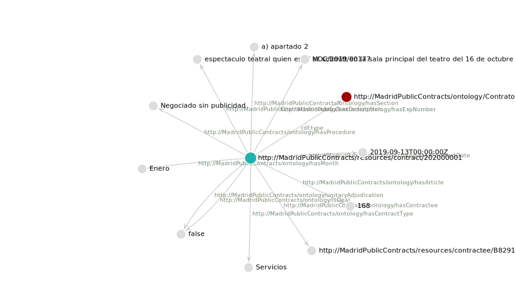

# [Back to application](./app_main.html) 

## Looking for an specific contract

Here we have an example of looking for a contract by its ID, we can also loof for contract from a specific month,  contract type...

	SELECT ?FIELD ?VALUE
		WHERE {
			<http://MadridPublicContracts/resources/contract/202000001> ?FIELD ?VALUE
		}

### Results

**Data about the contract**

|   Property                                                  |   Value                                                                                                                      | 
|-------------------------------------------------------------|------------------------------------------------------------------------------------------------------------------------------| 
| "http://www.w3.org/1999/02/22-rdf-syntax-ns#type"           | "http://MadridPublicContracts/ontology/Contrato"                                                                             | 
| "http://MadridPublicContracts/ontology/hasMonth"            | "Enero"                                                                                                                      | 
| "http://MadridPublicContracts/ontology/hasExpNumber"        | "MDC/2019/00177"                                                                                                             | 
| "http://MadridPublicContracts/ontology/hasDescription"      | "espectaculo teatral quien es el sr schmitt en la sala principal del teatro del 16 de octubre al 10 de noviembre (t.espaol)" | 
| "http://MadridPublicContracts/ontology/hasContractType"     | "Servicios"                                                                                                                  | 
| "http://MadridPublicContracts/ontology/hasProcedure"        | "Negociado sin publicidad"                                                                                                   | 
| "http://MadridPublicContracts/ontology/hasArticle"          | "168"                                                                                                                        | 
| "http://MadridPublicContracts/ontology/hasSection"          | "a) apartado 2"                                                                                                              | 
| "http://MadridPublicContracts/ontology/hasContractDate"     | "2019-09-13T00:00:00Z"                                                                                                       | 
| "http://MadridPublicContracts/ontology/hasContractee"       | "http://MadridPublicContracts/resources/contractee/B82917063"                                                                | 
| "http://MadridPublicContracts/ontology/isDeal"              | "false"                                                                                                                      | 
| "http://MadridPublicContracts/ontology/unitaryAdjudication" | "false"                                                                                                                      | 

**Graph**

