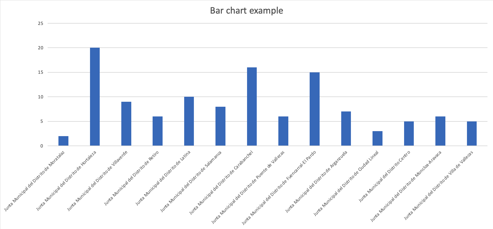

# [Back to application](./app_main.html) 

## Visualize the number of contracts for each district

If you want to see some analytics, e.g. how many contracts belong to each district board, you can obtain this data and usi it to generate graphical information.

	SELECT ?Org (COUNT(?Contract) as ?Number_of_contrancts)
    WHERE {
      ?Contract <http://MadridPublicContracts/ontology/hasContractor> ?Org.
    }GROUP BY ?Org

### Results

**Data table**

|**District board**                                                                                               | **N**| 
|-----------------------------------------------------------------------------------------------------------------|------| 
| "http://MadridPublicContracts/resources/junta/Junta%20Municipal%20del%20Distrito%20de%20Moratalaz"              | "2"  | 
| "http://MadridPublicContracts/resources/junta/Junta%20Municipal%20del%20Distrito%20de%20Hortaleza"              | "20" | 
| "http://MadridPublicContracts/resources/junta/Junta%20Municipal%20del%20Distrito%20de%20Villaverde"             | "9"  | 
| "http://MadridPublicContracts/resources/junta/Junta%20Municipal%20del%20Distrito%20de%20Retiro"                 | "6"  | 
| "http://MadridPublicContracts/resources/junta/Junta%20Municipal%20del%20Distrito%20de%20Latina"                 | "10" | 
| "http://MadridPublicContracts/resources/junta/Junta%20Municipal%20del%20Distrito%20de%20Salamanca"              | "8"  | 
| "http://MadridPublicContracts/resources/junta/Junta%20Municipal%20del%20Distrito%20de%20Carabanchel"            | "16" | 
| "http://MadridPublicContracts/resources/junta/Junta%20Municipal%20del%20Distrito%20de%20Puente%20de%20Vallecas" | "6"  | 
| "http://MadridPublicContracts/resources/junta/Junta%20Municipal%20del%20Distrito%20de%20Fuencarral-El%20Pardo"  | "15" | 
| "http://MadridPublicContracts/resources/junta/Junta%20Municipal%20del%20Distrito%20de%20Arganzuela"             | "7"  | 
| "http://MadridPublicContracts/resources/junta/Junta%20Municipal%20del%20Distrito%20de%20Ciudad%20Lineal"        | "3"  | 
| "http://MadridPublicContracts/resources/junta/Junta%20Municipal%20del%20Distrito%20Centro"                      | "5"  | 
| "http://MadridPublicContracts/resources/junta/Junta%20Municipal%20del%20Distrito%20de%20Moncloa-Aravaca"        | "6"  | 
| "http://MadridPublicContracts/resources/junta/Junta%20Municipal%20del%20Distrito%20de%20Villa%20de%20Vallecas"  | "5"  | 

**Charts**

Bar chart example

