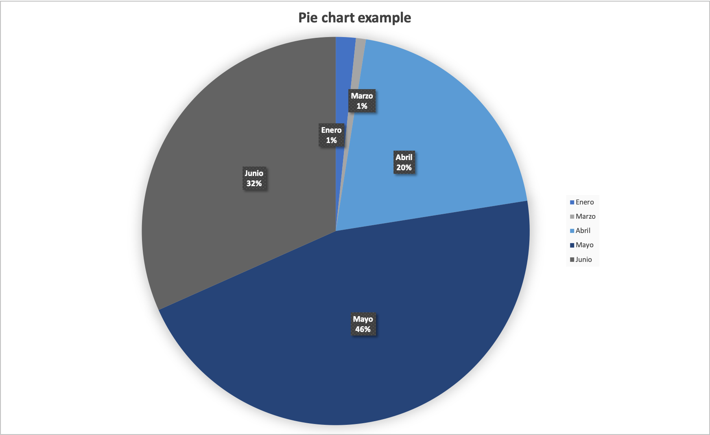

# [Back to application](./app_main.html) 

## Visualize the number of emergency contracts by month

For developing this query, a regex filter was implemented to seach for contracts in which description appeared the word "emergency". This information can also be graphically represented.

	SELECT ?Month (COUNT(?Contract) as ?Number_of_contrancts)
    WHERE {
      ?Contract <http://purl.org/terms/description> ?emergency. 
      FILTER REGEX(?emergency ,"emergencia", "i").   
      ?Contract <http://MadridPublicContracts/ontology/hasMonth> ?Month.
       }GROUP BY ?Month

### Results

**Data table**

|**Month**|**N** | 
|---------|------| 
| "Enero" | "2"  | 
| "Marzo" | "1"  | 
| "Abril" | "24" | 
| "Mayo"  | "55" | 
| "Junio" | "38" | 

**Charts**

Pie chart

